<h1>Compte Rendu</h1>
<h3>Partie authentification</h3>
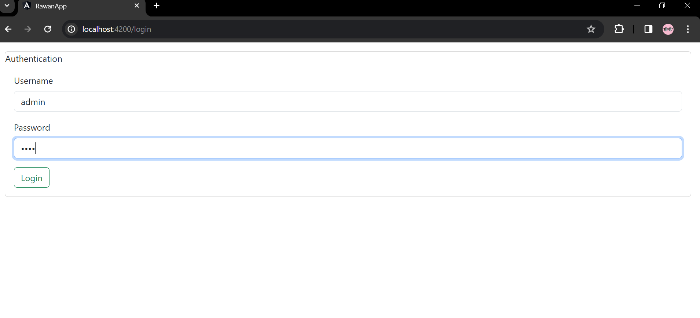
<h3>authentification si le password est incorrect</h3>
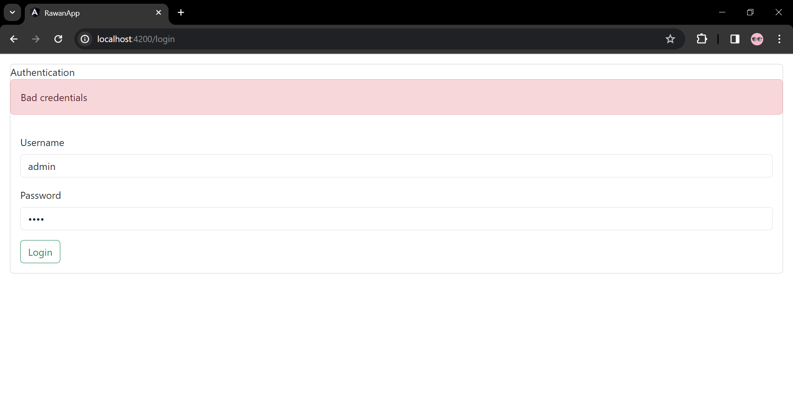
<h3>Produits dans la partie admin</h3>
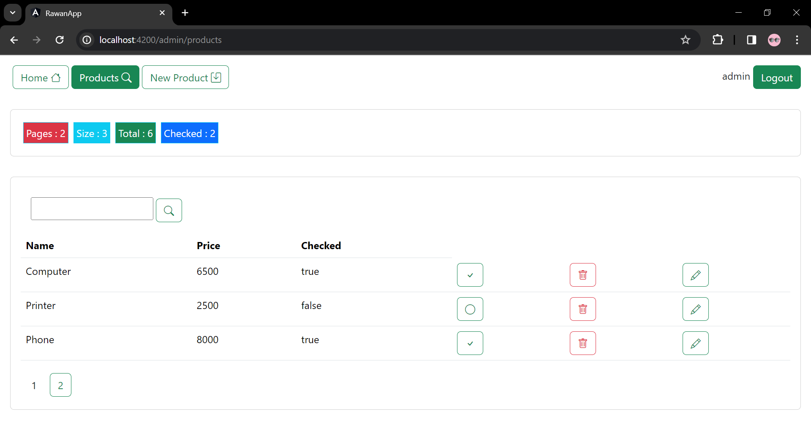
<h3>Produits dans la partie user</h3>
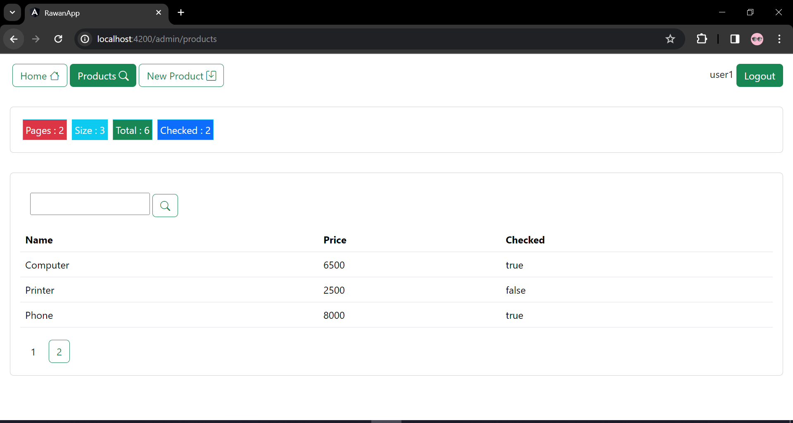
<h3>new-products dans la partie admin</h3>
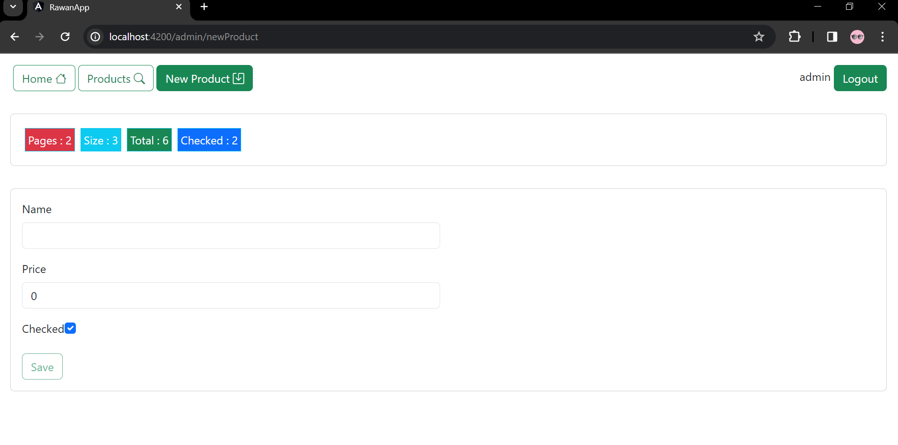
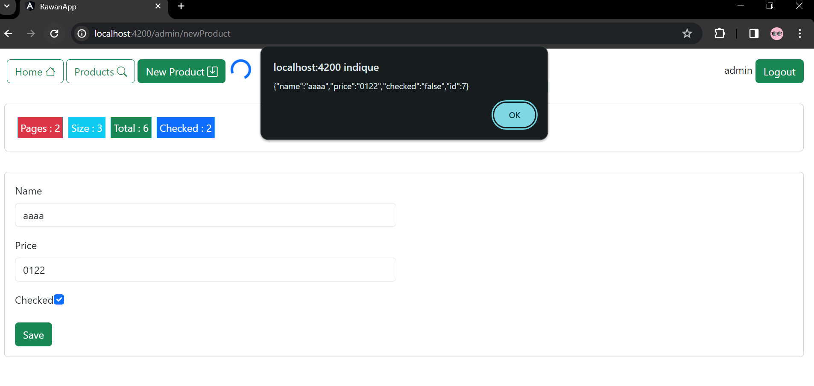
<h3>new-products dans la partie user</h3>
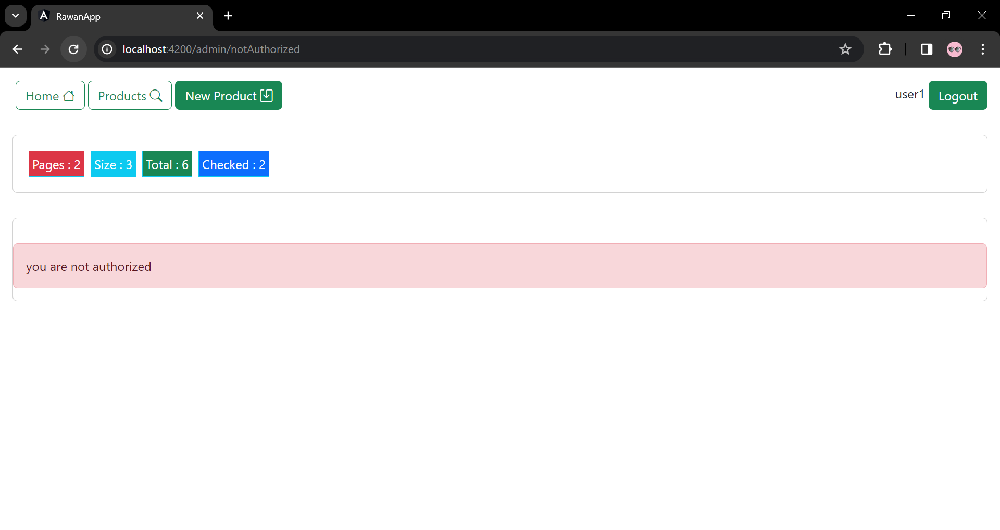
<h3>modifier le produits dans la partie admin</h3>
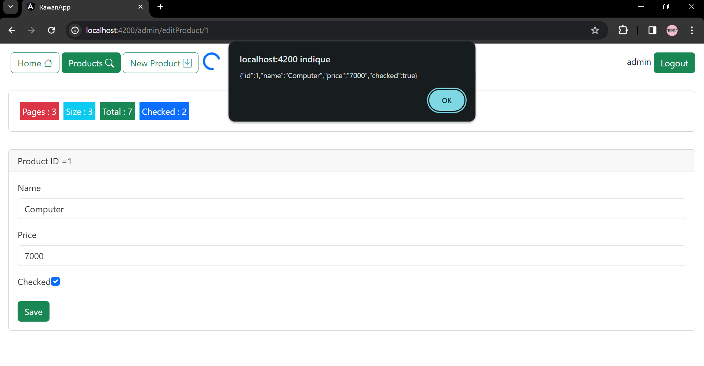
<h3>suppression du produit</h3>
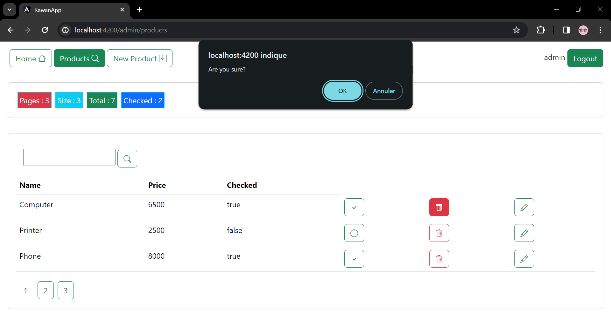
<h3>jwt-admin (token)</h3>
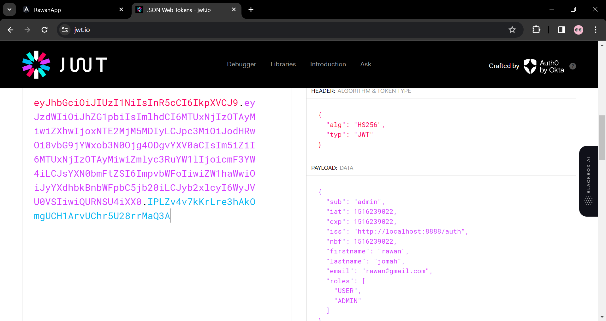
<h3>jwt-user (token)</h3>
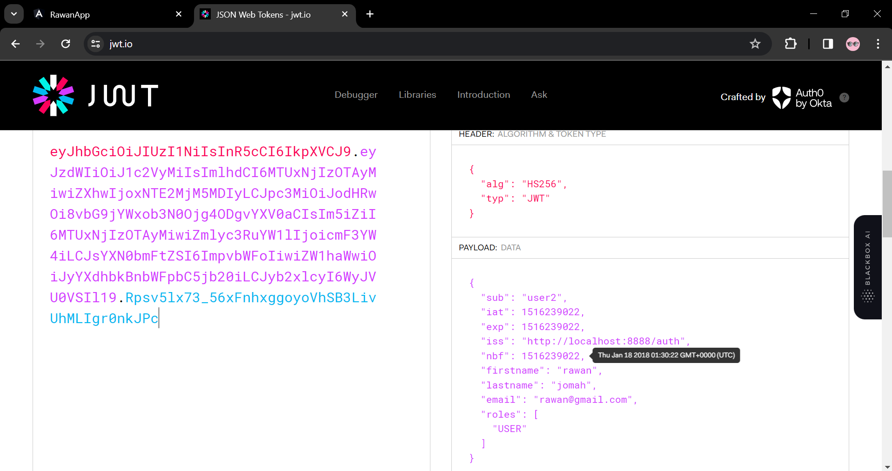
"# angular_project" 
